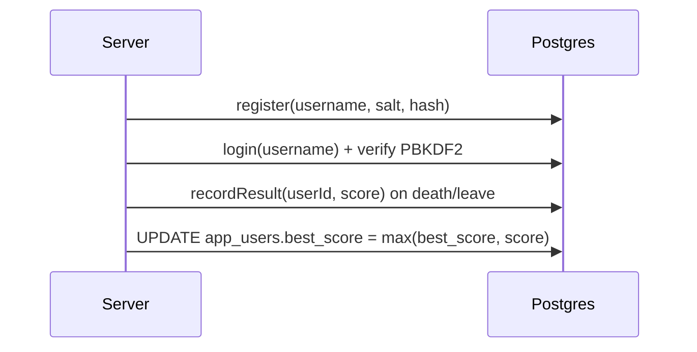

# ARCHITECTURE — PaperFX (MVP)

## 1) Модули
- `common/` — общие DTO и JSON-хелперы (`Net`, `Messages`)
- `server/` — TCP сервер, комнаты, игровой цикл, Postgres persistence
- `client/` — JavaFX клиент: рендер поля, ввод, чат, лидерборд

---

## 2) Потоки выполнения (сервер)

- **Accept thread**: принимает TCP подключения и создаёт `ClientConn`
- **ClientConn thread (на клиента)**: читает строки JSONL и передаёт в `ServerMain.onMessage(...)`
- **Game loop thread** (`ScheduledExecutorService`):
  - каждые ~50мс вызывает `room.step(dt)`
  - затем рассылает `room.broadcastState(tick)` всем подключенным в комнате

```mermaid
flowchart TD
  A[ServerSocket.accept] --> B[ClientConn (thread)]
  B -->|JSONL line| C[ServerMain.onMessage]
  C --> D[Room.join / input / chatSend]
  E[Game loop thread] --> F[Room.step(dt)]
  E --> G[Room.broadcastState(tick)]
  G --> B
```

---

## 3) Игровая модель комнаты

- `owners[]` — владение клетками
- `players{playerId -> PlayerEntity}` — игроки
- `trailSet/trailList` у игрока — след за пределами территории
- захват территории — flood-fill с границ (см. `game-rules.md`)

---

## 4) Данные и persistence

Postgres таблицы (в MVP):
- `app_users` — пользователи + `best_score`, `games_played`
- `game_results` — история результатов (score на момент смерти/выхода)
- `achievements` — заготовка под будущую систему достижений


