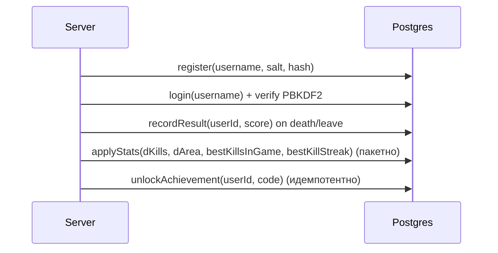

# ARCHITECTURE — PaperFX (актуальная версия, UDP)

## 1) Модули
- `common/` — общие DTO и JSON-хелперы (`Net`, `Messages`)
- `server/` — **UDP** сервер, комнаты, игровой цикл, PostgreSQL persistence, статистика/достижения
- `client/` — JavaFX клиент: рендер поля, ввод, чат, профиль

---

## 2) Потоки выполнения (сервер)

- **udp-receiver thread**: принимает UDP-датаграммы (`DatagramSocket.receive`) и передаёт JSON в `ClientConn.onDatagram(...)`
- **game-loop thread** (`ScheduledExecutorService`):
  - каждые ~50мс вызывает `room.step(dt)`
  - затем рассылает `room.broadcastState(tick)` всем подключённым (в комнате)

Сессии в UDP-режиме:
- идентифицируются по `InetSocketAddress (ip:port)` клиента
- хранятся в `clientsByAddr`
- удаляются по таймауту бездействия (~90с)

```mermaid
flowchart TD
  A[DatagramSocket.receive] --> B[udp-receiver thread]
  B -->|JSON| C[ClientConn.onDatagram]
  C --> D[ServerMain.onMessage]
  D --> E[Room.join / input / chat / profile_get]

  F[game-loop thread] --> G[Room.step(dt)]
  F --> H[Room.broadcastState(tick)]
  H --> I[DatagramSocket.send]
```

---

## 3) Игровая модель комнаты

- `owners[]` — владение клетками
- `players{playerId -> PlayerEntity}` — игроки (до 4)
- `trailSet/trailList` у игрока — след за пределами территории
- захват территории — flood‑fill «снаружи» (см. `game-rules.md`)
- наблюдатели (`spectator=true`) не имеют `PlayerEntity`, но получают `state`

---

## 4) Данные и persistence

PostgreSQL таблицы (актуально для текущей версии):
- `app_users` — пользователи + `best_score`, `games_played`
- `game_results` — история результатов (score на момент смерти/выхода)
- `user_stats` — накопительная статистика (kills/area и best-метрики)
- `achievements` — разблокированные достижения

Схема взаимодействия (упрощённо):


